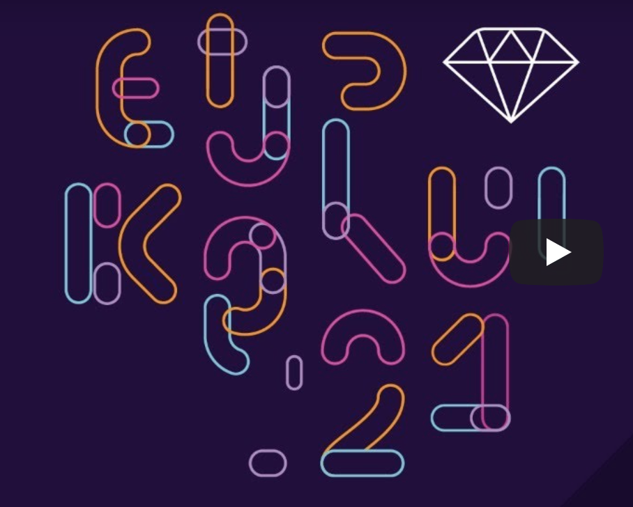
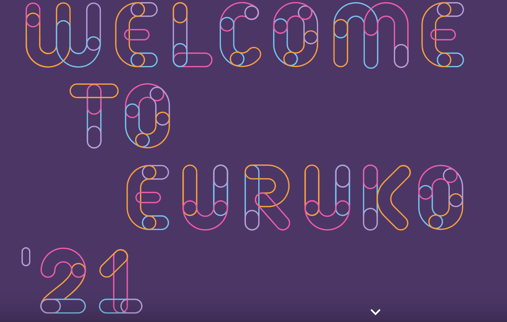

# ❓ What is this?

This is a small repo containing some basic HTML, SVG and CSS files that are
styling and animating the logos seen at EuRuKo conferences in 2021 and
[2022](https://2022.euruko.org/). EuRuKo is a conference for the Ruby
programming language, and the conference is held in different places in Europe.

# 🤔 Why I made this

I participated to EuRuKo2021 with a diversity scholarship ticket. Due to COVID,
this conference was arranged as a virtual conferenve. I enjoyed the talks very
much, and I had fun meeting other developers. But what won my heart over was the
beginner-friendly and really welcoming attitude of the Ruby community! 💗 I am a
JavaScript developer, and knew only the basics of Ruby, but everyone was really
welcoming to me, and didn't question why I was there.

When I was in the audience, I realised that the host who spoke between the
talks, was in front of an interesting image. At first I thought it was an
animation, but realised pretty quickly that it was just a still photo.

Here's a screenshot of the background:

After realising that this was just a still image, I went to the official 2021
conference website, and checked if the logo on the site had some sort of
animation or hover transition - but I was disappointed, it didn't. It was just a
still img (I think either .jpg or .png). See another screenshot below:

However, I realised that even though the organizers hadn't animated the logo, I
could do it myself! So I started this repo, and started the work.

## There are some leftover letters that have styles and html for them, but not used anywhere. What's the story there?

In the beginning, I thought I'd animate a "Welcome to Euruko'21" text, but as
the time from the conference passed, I changed it to "Thank you Euruko'21".

When the place, time and a new website for the 2022 conference was announced, I
noticed that the organizers had kept the 2021's font in letters, but had changed
the

I don't want to delete the styles and html for the leftover letters, as I or
someone else might find them useful, so they are still there.

# 🧐 What can you do with this?

Well, that's up to you. For example, you can use it as a reference point, if
you're learning what one can do with just HTML, SVG and CSS styles and
animations.
